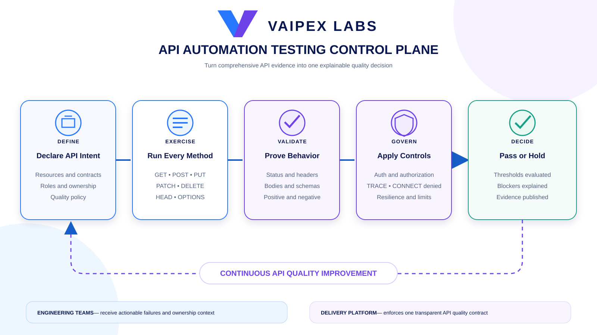
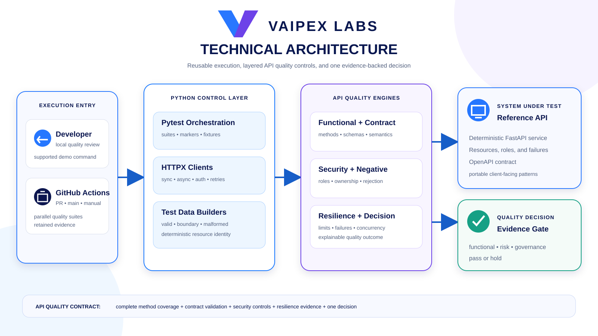

# Vaipex API Automation Testing Control Plane

An open reference implementation for comprehensive, repeatable, and
evidence-backed API quality validation through one consistent engineering
experience.

Developed by **Vaipex Labs** for the developer, quality engineering, test
automation, and platform engineering communities.


[Project Intent](#project-intent) ·
[What It Will Prove](#what-it-will-prove) ·
[HTTP Method Coverage](#http-method-coverage) ·
[Delivery Flow](#delivery-flow) ·
[Architecture](#architecture) ·
[Target Demo](#target-demo) ·
[Delivery Roadmap](#delivery-roadmap)

## Project Intent

API automation is more than sending requests and asserting status codes. A
credible quality signal must validate behavior, contracts, authorization,
failure handling, idempotency, concurrency, and the evidence required to make a
release decision.

This single project demonstrates an enterprise API automation control plane. It
will provide a deterministic reference API, reusable HTTP clients and test-data
builders, comprehensive functional and non-functional scenarios, governed
quality policy, continuous execution, and one explainable quality outcome.

## What It Will Prove

- All application-relevant HTTP methods are exercised through real resource
  workflows rather than placeholder endpoints.
- `TRACE` and `CONNECT` are explicitly rejected as part of the security posture.
- Request bodies, response bodies, headers, status codes, and schemas are
  validated together.
- Positive, negative, boundary, and malformed-request scenarios remain
  deterministic and repeatable.
- Authentication and authorization controls are tested across roles and
  resource ownership boundaries.
- Pagination, filtering, sorting, conditional requests, and caching semantics
  are verified.
- `PUT`, `DELETE`, and idempotency-key behavior are checked for safe repetition.
- Rate limiting, dependency failure, timeout, retry, and concurrency scenarios
  produce reviewable resilience evidence.
- Local execution and GitHub Actions use the same supported commands.
- Machine-readable and human-readable evidence support one quality decision.

## HTTP Method Coverage

| Method | Business behavior under test |
| --- | --- |
| `GET` | Retrieve collections and individual resources |
| `POST` | Create resources and process idempotency keys |
| `PUT` | Replace complete resources and verify repeatability |
| `PATCH` | Apply partial updates without losing untouched fields |
| `DELETE` | Remove resources and define repeated-delete behavior |
| `HEAD` | Return representation headers without a response body |
| `OPTIONS` | Advertise supported methods and validate CORS policy |
| `TRACE` | Confirm the method is disabled |
| `CONNECT` | Confirm proxy tunnelling is rejected by the application |

## Delivery Flow

API intent moves through reusable execution, layered validation, governed
controls, correlated evidence, and one transparent quality decision.



## Architecture

Developers and GitHub Actions invoke the same Python control layer. Reusable
HTTPX clients exercise a deterministic FastAPI service while functional,
contract, security, and resilience engines produce evidence for the release
confidence gate.



## Target Demo

The finished repository will expose one supported demonstration:

```bash
./scripts/two-minute-demo.sh
```

The demo will start the reference API, execute the complete method and quality
suite, generate HTML and JUnit evidence, and print the resulting `PASS` or
`HOLD` decision with its rationale.

## Reference API

The repository includes a deterministic order API with explicit ownership,
role, and failure contracts. Start it locally:

```bash
./scripts/start-api.sh
```

Then open the interactive OpenAPI documentation at
[http://127.0.0.1:8080/docs](http://127.0.0.1:8080/docs). Use `Control-C` to
stop the service, or set another port with `PORT=8081 ./scripts/start-api.sh`.

The following non-secret demonstration identities make authorization scenarios
repeatable:

| Bearer token | Identity | Role |
| --- | --- | --- |
| `demo-admin-token` | `admin-001` | Administrator across all resources |
| `demo-operator-token` | `user-001` | Operator for owned resources |
| `demo-other-token` | `user-002` | Second ownership boundary |
| `demo-viewer-token` | `user-003` | Read-only access to owned resources |

Send `X-Vaipex-Failure: dependency`, `rate-limit`, or `timeout` to an order
request to trigger a deterministic failure response. Administrators can restore
the three seeded orders with `POST /v1/admin/reset`.

## Toolchain

| Tool | Role |
| --- | --- |
| Python 3.12 | Test orchestration and quality policy |
| Pytest | Scenario execution, parametrization, and assertions |
| HTTPX | Reusable synchronous and asynchronous API clients |
| FastAPI | Deterministic reference service |
| Pydantic / JSON Schema | Request and response contract validation |
| Schemathesis | OpenAPI-driven property and negative testing |
| Ruff | Static quality enforcement |
| GitHub Actions | Continuous validation and retained evidence |

Direct dependencies are pinned in `pyproject.toml`; the fully resolved
transitive dependency graph is committed in `requirements.lock`. Set up the
complete Python 3.12 environment with one command:

```bash
./scripts/setup.sh
```

Validate an existing environment without modifying it:

```bash
./scripts/validate-toolchain.sh
```

Run the repository quality checks:

```bash
./scripts/test.sh
```

## Delivery Roadmap

- [x] Establish the private repository, licensing, intent, and Vaipex diagrams.
- [x] Add the locked Python API-automation toolchain and validation commands.
- [x] Deliver the deterministic reference API and resource model.
- [ ] Add reusable clients, test-data builders, and environment configuration.
- [ ] Test `GET`, `POST`, `PUT`, `PATCH`, `DELETE`, `HEAD`, and `OPTIONS`.
- [ ] Verify `TRACE` and `CONNECT` rejection plus authentication and authorization.
- [ ] Add contract, negative, boundary, pagination, and caching validation.
- [ ] Add idempotency, rate-limit, timeout, resilience, and concurrency scenarios.
- [ ] Publish HTML, JUnit, and machine-readable quality evidence.
- [ ] Enforce the suite through GitHub Actions and a quality decision gate.
- [ ] Deliver the two-minute demo and final community-facing documentation.

Each milestone will remain independently reviewable and preserve a usable
project state.

## Repository Shape

```text
.github/workflows/     Continuous API quality enforcement
docs/images/           Vaipex flow and architecture illustrations
policies/              Versioned API quality and release thresholds
scripts/               Supported setup, execution, and demo commands
src/                   Reference API and automation control-plane code
tests/                  Functional, contract, security, and resilience suites
```

## Project Boundaries

This project demonstrates API automation and quality governance. It does not
replace production observability, penetration testing, capacity engineering,
or product risk ownership. It provides a transparent engineering signal that
supports safer API delivery decisions.

## Contributing

Community contributions are welcome. Keep scenarios deterministic, contracts
explicit, evidence complete, and quality decisions explainable.

Licensed under the [Apache License 2.0](LICENSE).
